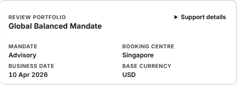
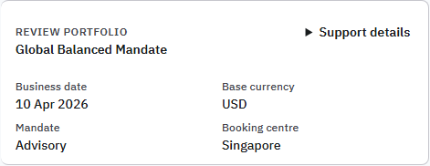
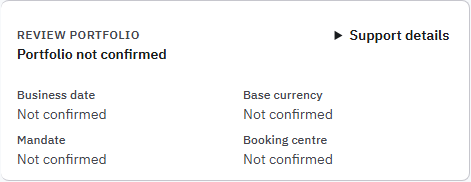

# Issue #814 review-context rendered evidence

## Evidence boundary

This pack records the responsive review of the shared Workbench review-context strip and its
surrounding Portfolio Review hierarchy. It was generated from product implementation head
`66325985edda5907c1ed0fd8fed4800b4d2985ed` on 30 August 2026.

The run uses the repository-owned deterministic **degraded-state fixture**. It proves layout,
interaction, source-limitation language, and fail-closed presentation; it is not canonical runtime
or demo-ready evidence. Canonical all-five-workspace proof remains owned by #814.

Command:

```powershell
$env:PORTFOLIO_E2E_WORKBENCH_PORT='31022'
$env:PORTFOLIO_E2E_EVIDENCE_DIR='<repository>\output\playwright\issue-814-review-context-8072d09c'
npm run test:e2e:portfolio:review-matrix
```

Result: 1/1 Playwright scenario passed across 1440, 1024, 768, 721, 720, 561, and
519 pixel viewports. The machine-readable record confirms zero horizontal document overflow,
all measured rail/header regions fit, each governed identity fact is owned by the strip, and all
21 sequential keyboard targets sampled at 519 pixels are visible, unobscured, and focus-visible.
It also records the six semantic context slots, their DOM order, bounding boxes, productive type
roles, and overflow dimensions.

The separate source-state fixture passed 1/1 across confirmed, partial, and unavailable states at
1440, 1024, 768, and 519 pixels. All states retain the same semantic slot order, strip height, and
responsive row geometry; only truthful content, value emphasis, and the existing source-state
accent change.

## Visual review

| Viewport | Review result |
| --- | --- |
| 1440 | Portfolio identity anchors the header; business date, currency, mandate, and booking centre form one content-sized fact group instead of equal-width islands. Support details remains a quiet, separate action. Shell rail, primary decision, action, and evidence regions remain aligned without overlap. |
| 1024 | Context reflows without clipping; the navigation rail becomes a compact horizontal control and the business decision sequence remains review focus, controls, limitations, action, then evidence. |
| 768 | Context and workspace navigation remain distinct, readable rows. Cards and controls reflow without horizontal scrolling or duplicated portfolio identity. |
| 519 | Context becomes a compact two-column business summary; the page retains 16-pixel-equivalent reading flow, complete keyboard access, and neutral interaction state. No tooltip, control, or text overlaps the return metrics. |

The degraded fixture truthfully presents qualified performance evidence, unavailable MTD return,
and the source-owned next action. No success, completeness, or execution state is fabricated.
The strip owns portfolio, client, mandate, booking centre, business date, and currency orientation;
the surrounding screen uses that context rather than repeating it.

## Diagnostic full-page renders

### 1440 pixels


### 1024 pixels


### 768 pixels


### 519 pixels


## Diagnostic review-context close-ups

### 1440 pixels


### 519 pixels



## Source-state composition

| State | 1440 pixels | 519 pixels |
| --- | --- | --- |
| Confirmed |  |  |
| Partial |  |  |
| Unavailable |  |  |

Intermediate responsive captures:

- confirmed: [1024 pixels](./diagnostic-confirmed-review-context-1024.png), [768 pixels](./diagnostic-confirmed-review-context-768.png)
- partial: [1024 pixels](./diagnostic-partial-review-context-1024.png), [768 pixels](./diagnostic-partial-review-context-768.png)
- unavailable: [1024 pixels](./diagnostic-unavailable-review-context-1024.png), [768 pixels](./diagnostic-unavailable-review-context-768.png)

Machine-readable measurements and keyboard evidence are in
[`portfolio-review-accessibility-evidence.json`](./portfolio-review-accessibility-evidence.json).
Source-state typography and layout evidence is in
[`review-context-typography-states.json`](./review-context-typography-states.json).
