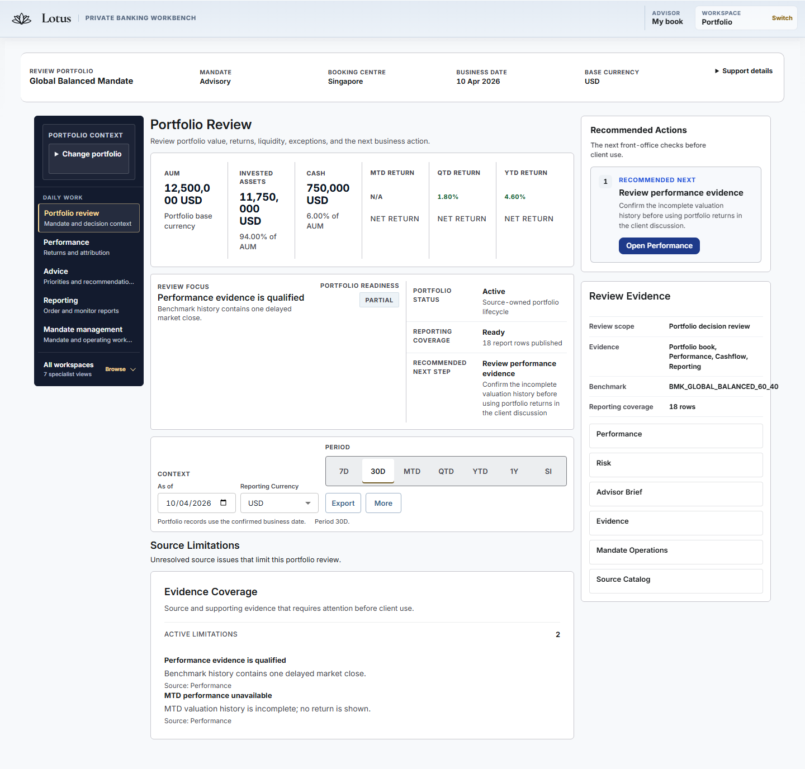
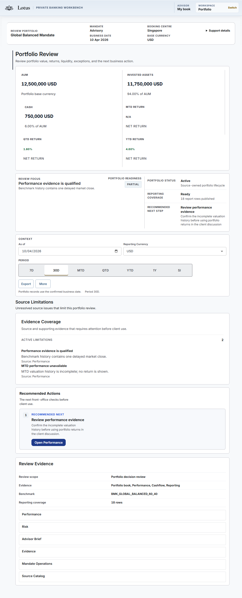
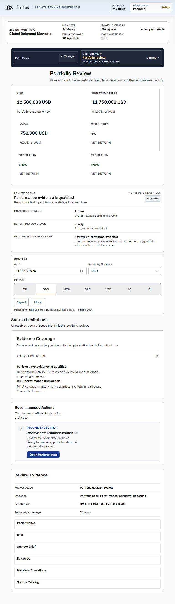
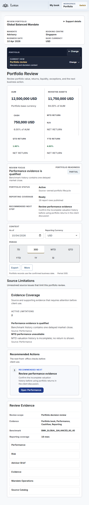
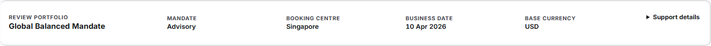

# Issue #814 review-context rendered evidence

## Evidence boundary

This pack records the responsive review of the shared Workbench review-context strip and its
surrounding Portfolio Review hierarchy. It was generated from product implementation head
`8072d09c61305396d277ba2b8bc5a2f438e751ce` on 23 August 2026.

The run uses the repository-owned deterministic **degraded-state fixture**. It proves layout,
interaction, source-limitation language, and fail-closed presentation; it is not canonical runtime
or demo-ready evidence. Canonical all-five-workspace proof remains owned by #814.

Command:

```powershell
$env:PORTFOLIO_E2E_WORKBENCH_PORT='31022'
$env:PORTFOLIO_E2E_EVIDENCE_DIR='<repository>\output\playwright\issue-814-review-context-8072d09c'
npm run test:e2e:portfolio:review-matrix
```

Result: 1/1 Playwright scenario passed across 1440, 1024, 768, 721, 720, 561, and
519 pixel viewports. The machine-readable record confirms zero horizontal document overflow,
all measured rail/header regions fit, each governed identity fact is owned by the strip, and all
21 sequential keyboard targets sampled at 519 pixels are visible, unobscured, and focus-visible.

## Visual review

| Viewport | Review result |
| --- | --- |
| 1440 | Context remains a single orientation row above the decision workspace. Shell rail, primary decision, action, and evidence regions remain aligned without overlap. Existing financial-value mid-number wrapping is visible in the six-column KPI band and is explicitly owned by typography follow-up #829. |
| 1024 | Context reflows without clipping; the navigation rail becomes a compact horizontal control and the business decision sequence remains review focus, controls, limitations, action, then evidence. |
| 768 | Context and workspace navigation remain distinct, readable rows. Cards and controls reflow without horizontal scrolling or duplicated portfolio identity. |
| 519 | Context becomes a compact two-column business summary; the page retains 16-pixel-equivalent reading flow, complete keyboard access, and neutral interaction state. No tooltip, control, or text overlaps the return metrics. |

The degraded fixture truthfully presents qualified performance evidence, unavailable MTD return,
and the source-owned next action. No success, completeness, or execution state is fabricated.
The strip owns portfolio, client, mandate, booking centre, business date, and currency orientation;
the surrounding screen uses that context rather than repeating it.

## Full-page renders

### 1440 pixels



### 1024 pixels



### 768 pixels



### 519 pixels



## Review-context close-ups

### 1440 pixels



### 519 pixels


Machine-readable measurements and keyboard evidence are in
[`portfolio-review-accessibility-evidence.json`](./portfolio-review-accessibility-evidence.json).
