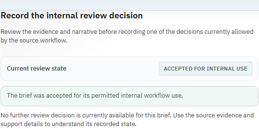
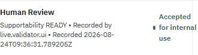

# Issue 819 Advisor Brief Review Proof

This focused evidence pack demonstrates the Workbench boundary fix for a persisted Advisor Brief
`ACCEPT` decision. It was generated from Workbench branch
`fix/819-advisor-brief-review-proof` at `d447f4e3` on 24 August 2026 against the shared local
front-office development runtime and canonical portfolio `PB_SG_GLOBAL_BAL_001`.

## Proven

- The Workbench BFF first returned an actionable `AWAITING_REVIEW` run.
- One confirmed browser action produced one HTTP 200 BFF `POST` for the same run.
- The source response reported `ACCEPTED`, `READY`, `review_pending=false`, raw Lotus AI actor
  `review:live.validator.ui`, and an explicit UTC event time.
- The same visible **Human Review** row reported `ACCEPTED`, `READY`, business reviewer
  `live.validator.ui`, and the identical UTC event time through its atomic evidence attributes.
- Workbench showed success only after that response passed the source-transition agreement check.

## Reviewer Evidence

Machine-readable request, response, and DOM evidence is in
[`live-validation-summary.json`](live-validation-summary.json).

## Boundary

This is focused development-runtime proof, not complete canonical certification or production
identity evidence. The shared Gateway and Advise `/version` responses did not publish exact build
provenance, and the full canonical validator still stops before browser execution on the separate
retained idempotency-key conflict tracked by `lotus-advise#482`. The pack does not prove production
authentication, entitlement, client-release permission, or the complete front-office journey.

The captures are close-ups of the persisted business result. They are not a visual-quality approval
of the complete Advisor Brief screen.
