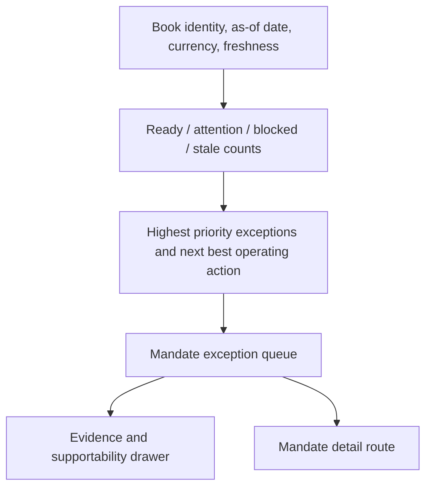
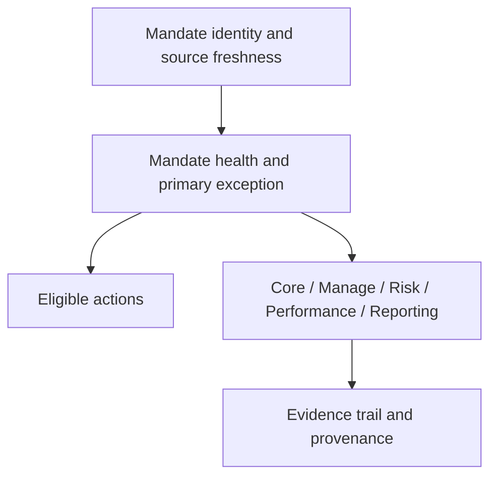

# RFC-0098: DPM Mandate Command Center Experience

| Metadata | Details |
| --- | --- |
| **Status** | PROPOSED |
| **Created** | 2026-05-03 |
| **Owner** | lotus-workbench |
| **Primary Upstream Contract** | lotus-gateway RFC-0098 `DPM Command Center` |
| **Depends On** | lotus-manage RFC-0037, lotus-manage RFC-0038, lotus-gateway RFC-0098, lotus-core RFC-0087, Workbench RFC-0076/RFC-0077 canonical proof contracts |
| **Doc Location** | `docs/rfcs/RFC-0098-dpm-mandate-command-center-experience.md` |

---

## 0. Executive Summary

`lotus-manage` now has the backend foundation for mandate digital twin, health scoring, DPM
operating state, and core-sourced stateful execution. `lotus-gateway` RFC-0098 defines the
composition contract that brings manage, core, risk, performance, reporting, archive, and AI signals
together without violating domain ownership.

This RFC defines the Workbench product experience that turns those service capabilities into a
sellable, client-demo-ready discretionary portfolio management command center.

The goal is not another analytics page. The goal is a daily operating cockpit for portfolio
managers and investment control teams:

1. what needs attention,
2. why it needs attention,
3. who owns remediation,
4. what action is safe,
5. what evidence supports the decision.

---

## 1. Business Outcomes

The command center must produce clear business outcomes:

1. **Portfolio manager control of the DPM book**
   PMs can start the day with a prioritized view of mandates that are ready, drifting, blocked,
   stale, underperforming, or awaiting action.
2. **Institutional mandate governance**
   Every visible exception is tied to client mandate, model portfolio, risk limit, performance
   posture, source readiness, or workflow evidence.
3. **Faster action with less operational noise**
   PMs can move from issue detection to simulation, proof-pack generation, deferral, or escalation
   without manually checking multiple systems.
4. **Business-friendly explanation**
   Sales, pre-sales, and client-demo users can explain how Lotus monitors discretionary mandates and
   protects client objectives.
5. **Operations-grade supportability**
   Operations can identify whether a bad state is caused by source data, analytics calculation,
   archive/report readiness, entitlement, or manage workflow state.
6. **Audit-ready decision trail**
   Actions, evidence refs, source systems, and supportability states are visible without exposing
   sensitive raw payloads.

---

## 2. Problem Statement

Workbench currently has strong portfolio, performance, risk, advisor-brief, and reporting surfaces,
but the DPM business journey is not yet realized as one coherent command center. The user should not
have to understand service boundaries to answer these questions:

1. Which mandates need attention today?
2. Which issue is most severe and why?
3. Is the portfolio ready to rebalance or blocked by source data?
4. Is the mandate drifting from the model?
5. Is the portfolio underperforming, riskier than intended, or breaching concentration limits?
6. Is there a proof pack or report ready for governance review?
7. What action can I safely take now?

The command center must make these answers visible while remaining truthful about upstream
supportability and domain ownership.

---

## 3. Product Principles

1. **Gateway-first**
   Workbench consumes only `lotus-gateway` command-center APIs for this surface.
2. **Exception-first**
   The first screen prioritizes attention, readiness, severity, and next action, not chart
   inventory.
3. **Evidence always available**
   Every important state links to source evidence, supportability, and ownership.
4. **No fake readiness**
   Empty, partial, blocked, stale, and degraded states must be explicit.
5. **PM workflow before service topology**
   The UI should read like a DPM operating cockpit, not a stitched set of backend modules.
6. **Demo-grade and operations-grade**
   The same surface should support client demos and real operator troubleshooting.

---

## 4. Target User Journeys

### 4.1 Portfolio Manager Morning Review

1. PM opens the DPM command center.
2. PM sees book-level counts by `ready`, `attention_required`, `blocked`, `stale`, and `degraded`.
3. PM filters to `attention_required`.
4. PM sorts by exception severity and business impact.
5. PM opens `PB_SG_GLOBAL_BAL_001`.
6. PM sees the primary issue, source readiness, mandate health score, model drift, risk posture,
   performance posture, and available action.
7. PM launches a stateful rebalance simulation only if Gateway marks simulation as eligible.

### 4.2 CIO / Investment Control Review

1. CIO desk opens the book view grouped by model portfolio.
2. The screen highlights mandates affected by model drift or CIO model change.
3. The user inspects risk and performance side panels without leaving the mandate context.
4. The user exports or triggers proof-pack generation when governance evidence is needed.

### 4.3 Operations Triage

1. Operations filters blocked mandates.
2. The screen identifies whether the block is market data, tax lots, eligibility, source readiness,
   report generation, entitlement, or upstream timeout.
3. Operations opens evidence and sees source owner, support reference, freshness, and remediation
   route.

### 4.4 Sales / Client Demo

1. Presenter opens the canonical portfolio `PB_SG_GLOBAL_BAL_001`.
2. The command center explains how Lotus connects core source data, mandate policy, risk,
   performance, and DPM workflow.
3. The presenter shows the evidence drawer and proof-pack posture.
4. The presenter demonstrates simulation handoff only from a truthful eligible state.

---

## 5. Information Architecture

### 5.1 Route Structure

| Route | Purpose |
| --- | --- |
| `/dpm` | Book-level DPM command center. |
| `/dpm/mandates/[portfolioId]` | Single-mandate command-center detail. |
| `/dpm/mandates/[portfolioId]/evidence` | Deep-linkable evidence and provenance view if needed. |

The route may live under an existing portfolio shell if product navigation makes that clearer, but
the DPM command center must remain a first-class application surface.

### 5.2 Book-Level Layout

Required modules:

1. book summary strip,
2. mandate state distribution,
3. prioritized exception queue,
4. filters by PM, region, model, severity, state, source owner, action eligibility,
5. compact row detail with health score, primary issue, rebalance readiness, risk state,
   performance state, source readiness, and latest action,
6. evidence drawer.

### 5.3 Single-Mandate Layout

Required modules:

1. mandate identity header,
2. health score and decomposed dimensions,
3. primary exception narrative,
4. source readiness panel,
5. DPM operating-state panel,
6. risk posture panel,
7. performance posture panel,
8. proof-pack/reporting panel,
9. evidence and provenance drawer,
10. action rail.

---

## 6. App Feature Contribution Map

Workbench must present each app contribution with domain-correct labels.

| App | Workbench display contribution |
| --- | --- |
| `lotus-core` | "Source Data Readiness": portfolio source state, holdings freshness, market data, model binding, tax lots, eligibility, lineage. |
| `lotus-manage` | "Mandate Operating State": digital twin, health score, drift, constraints, rebalance readiness, DPM action queue, active run refs. |
| `lotus-risk` | "Risk Posture": concentration, drawdown, liquidity, stress, active risk, risk attribution, risk supportability. |
| `lotus-performance` | "Performance Posture": return path, contribution, attribution, benchmark-relative performance, horizon trends, calculation supportability. |
| `lotus-report` | "Proof and Reporting": proof-pack readiness, report batch status, latest generated material, recovery posture. |
| `lotus-archive` | "Evidence Archive": generated document metadata, controlled download links, retention and archive refs. |
| `lotus-ai` | "Narrative Support": optional PM summary, explanation draft, task-flow posture, handoff refs. |
| `lotus-gateway` | "Composed Product Contract": unified command-center payload, degraded-state normalization, support references. |

Workbench must not expose raw service names as the main user journey. Service ownership should be
visible in evidence and operations views.

---

## 7. Gateway Contract Consumption

Workbench must consume:

1. `GET /api/v1/dpm/command-center`
2. `GET /api/v1/dpm/command-center/mandates/{portfolio_id}`
3. `GET /api/v1/dpm/command-center/mandates/{portfolio_id}/evidence`
4. `POST /api/v1/dpm/command-center/mandates/{portfolio_id}/actions/simulate`

Workbench BFF routes may wrap these Gateway endpoints for Next.js ergonomics, but they must not
reshape domain truth or call upstream domain apps directly.

The Workbench view model should preserve:

1. `mandate_state`,
2. `health_score`,
3. `health_band`,
4. `primary_exception`,
5. `rebalance_readiness`,
6. `risk_state`,
7. `performance_state`,
8. `source_readiness`,
9. `proof_pack_state`,
10. `recommended_actions`,
11. `supportability`,
12. `evidence_refs`,
13. `lineage`.

---

## 8. UX States

Every module must support:

| State | UX behavior |
| --- | --- |
| `loading` | Skeletons with stable layout dimensions. |
| `ready` | Full actionable module with as-of date and source freshness. |
| `attention_required` | Promote reason, severity, and next action. |
| `blocked` | Disable dependent action and show remediation owner. |
| `degraded` | Show partial data with explicit missing source and business impact. |
| `stale` | Mark stale data and suppress time-sensitive actions. |
| `not_supported` | Show a truthful unavailable state without implying failure. |
| `error` | Product-safe error with support reference and retry behavior. |

No state may silently hide an unavailable source if that source affects action eligibility.

---

## 9. Interaction Requirements

### 9.1 Book Filters

Required controls:

1. PM or book owner,
2. region,
3. model portfolio,
4. mandate state,
5. severity,
6. source owner,
7. action eligibility,
8. as-of date.

### 9.2 Mandate Row Actions

Possible row actions:

1. open mandate detail,
2. simulate rebalance,
3. investigate source data,
4. investigate risk,
5. investigate performance,
6. generate proof pack,
7. defer exception,
8. escalate for CIO/compliance/operations review.

Actions must be enabled only when Gateway returns them as eligible.

### 9.3 Evidence Drawer

The evidence drawer must show:

1. source systems,
2. data products,
3. as-of dates,
4. freshness,
5. calculation supportability,
6. report/archive refs,
7. support reference,
8. remediation owner,
9. restricted-field notice when data cannot be shown.

---

## 10. Visual and Content Standard

This is a private-banking operating surface, not a marketing landing page.

Design requirements:

1. dense but readable information hierarchy,
2. restrained color use tied to state and severity,
3. compact summary-first cards only where they represent repeated business objects,
4. no decorative gradients, oversized hero panels, or generic empty illustrations,
5. stable table and panel dimensions,
6. source freshness and as-of date visible in context,
7. business-friendly labels such as "Mandate Drift", "Source Readiness", "Risk Posture",
   "Performance Posture", and "Proof Pack",
8. drill-down by need, not by backend service boundary.

---

## 11. Implementation Slices

### Slice 0: Product and Contract Alignment

1. Finalize this RFC with Gateway RFC-0098.
2. Confirm command-center payload and module support states.
3. Update Workbench navigation plan and panel registry if a new DPM app surface is added.
4. Confirm canonical demo portfolio requirements.

Acceptance:

1. Workbench RFC references only Gateway command-center APIs.
2. No direct raw service consumption is planned.
3. Supported feature wording remains target-state until implementation proof exists.

### Slice 1: Route, BFF, and View-Model Foundation

1. Add `/dpm` route and optional `/dpm/mandates/[portfolioId]` route.
2. Add Workbench BFF wrappers over Gateway command-center endpoints.
3. Add typed view models and fixtures for ready, attention, blocked, degraded, stale, and
   not-supported states.
4. Add route-level error and loading states.

Acceptance:

1. Unit tests prove view-model preservation and state mapping.
2. Integration tests prove route rendering with mocked Gateway payloads.
3. No unsupported backend behavior is invented.

### Slice 2: Book-Level Command Center

1. Build the book summary strip.
2. Build state distribution and priority action area.
3. Build mandate exception queue.
4. Add filters and sort behavior.
5. Add evidence drawer from Gateway evidence refs.

Acceptance:

1. Ready and attention-required mandates render correctly.
2. Blocked and stale mandates disable unsafe actions.
3. Filtering and sorting preserve business state.
4. Accessibility roles and keyboard navigation are covered.

### Slice 3: Single-Mandate Detail

1. Build mandate identity header.
2. Build mandate health and primary exception section.
3. Build source readiness, DPM operating state, risk posture, performance posture, and proof/report
   panels.
4. Add action rail with Gateway-provided eligible actions.
5. Add drill-down to evidence drawer.

Acceptance:

1. Canonical `PB_SG_GLOBAL_BAL_001` route renders complete state when Gateway is ready.
2. Partial analytics degrade truthfully.
3. Source blocked state disables simulation.

### Slice 4: Action Handoff and Workflow Feedback

1. Wire simulate action to Gateway action endpoint.
2. Show run refs, next action, and supportability after simulation.
3. Support defer/escalate/proof-pack action placeholders only when Gateway implements them.
4. Preserve audit/evidence refs in the UI.

Acceptance:

1. Simulation cannot be triggered when Gateway marks it ineligible.
2. Successful simulation updates action state and run refs.
3. Failed action shows support reference and remediation guidance.

### Slice 5: Canonical Runtime and Live Evidence

1. Extend canonical front-office validation for DPM command center.
2. Seed or verify `PB_SG_GLOBAL_BAL_001` has realistic DPM, risk, performance, and reporting
   support data.
3. Capture browser evidence and request/response evidence in non-git tracked output.
4. Update panel registry and screenshot proof naming.

Acceptance:

1. `npm run live:stack:up` and `npm run live:validate` prove the surface.
2. Screenshots are captured only after API and panel validation pass.
3. Evidence includes ready and degraded/blocked examples where possible.

### Slice 6: Documentation, Wiki, and Demo Material

1. Update README and wiki with business explanation, diagrams, screenshots, and operating notes.
2. Add client-demo narrative for DPM command center.
3. Add operations troubleshooting guide for degraded sources.
4. Update supported features only after live proof.

Acceptance:

1. Wiki is useful to developers, business, operations, sales, pre-sales, marketing, and clients.
2. Documentation distinguishes implemented truth from target-state roadmap.
3. `Sync-RepoWikis.ps1 -CheckOnly -Repository lotus-workbench` passes before merge.

### Slice 7: Hardening and Closure

1. Code review the complete surface.
2. Remove dead UI code or stale DPM/advisory leftovers encountered.
3. Verify no direct raw service calls exist.
4. Verify accessibility, responsive layout, keyboard navigation, and non-overlapping text.
5. Run full Workbench CI lane and canonical runtime proof.

Acceptance:

1. Lint, typecheck, tests, coverage, build, Playwright, and Docker parity pass.
2. Canonical live proof passes.
3. Branch is clean, PR is merged, wiki is published.

---

## 12. Testing Strategy

| Layer | Required coverage |
| --- | --- |
| Unit | view-model mapping, supportability state rendering, action eligibility, formatters, filter logic |
| Integration | route rendering, BFF wrappers, error/degraded states, evidence drawer |
| Browser smoke | book view, mandate detail, filters, action rail, evidence drawer |
| Live canonical | Gateway-backed command-center response for `PB_SG_GLOBAL_BAL_001` |
| Visual proof | screenshot pack and `SHOT-INDEX.md` after validation |
| Accessibility | keyboard navigation, roles, focus order, visible labels, non-color-only severity |

Tests must prove real behavior and risks. Snapshot-only or text-presence-only tests are not enough
for this surface.

---

## 13. Documentation and Wiki Requirements

Workbench documentation must include:

1. business purpose,
2. user journeys,
3. app contribution map,
4. upstream/downstream integration diagram,
5. feature coverage,
6. non-functional posture,
7. degraded-state behavior,
8. canonical validation instructions,
9. demo script,
10. screenshot evidence index.

The documentation must be polished enough for business users, operations, sales, pre-sales, and
client pitches. It must also be implementation-backed and honest about unsupported features.

---

## 14. Risks and Controls

| Risk | Control |
| --- | --- |
| UI becomes a stitched service dashboard | Use Gateway command-center contract and PM workflow language. |
| UI invents unsupported actions | Enable actions only from Gateway `recommended_actions`. |
| Business users misunderstand degraded data | Show source owner, reason, freshness, and business impact. |
| Surface becomes too dense | Use summary-first hierarchy and detail-on-demand. |
| Demo claims exceed implementation | Promote supported features only after live proof and screenshots. |
| Raw sensitive data leaks | Evidence drawer uses Gateway-safe refs and controlled links only. |

---

## 15. Definition of Done

This RFC is complete only when:

1. Workbench has a first-class DPM command-center surface,
2. Gateway RFC-0098 contract is consumed end to end,
3. no direct raw service calls are used for command-center data,
4. book and single-mandate journeys are implemented,
5. ready, attention, blocked, degraded, stale, not-supported, and error states are tested,
6. simulation handoff is action-gated by Gateway,
7. canonical live proof passes with `PB_SG_GLOBAL_BAL_001`,
8. screenshots and request/response evidence are captured,
9. README, wiki, RFC index, supported-features, and repository context are updated,
10. CI is green,
11. post-merge wiki publication is complete.

---

## 16. Relationship to Gateway RFC-0098

Gateway RFC-0098 is the contract RFC. This RFC is the product realization RFC. The business outcome
is complete only when both are delivered:

1. Gateway composes certified domain products into one product-facing contract.
2. Workbench renders that contract into a daily DPM operating cockpit.
3. Domain services retain their authority.
4. Platform canonical automation proves the integrated stack.
