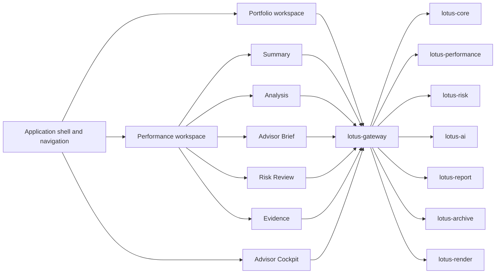

# Architecture

## Runtime model

- Next.js App Router application
- app-route mounting under `src/app/`
- app-local product ownership under `src/apps/`
- shared primitives under `src/design-system/`
- shell composition under `src/shell/`
- internal `/api/bff/*` proxy bridge to `lotus-gateway`

## Product-surface map

- `Portfolio`
  primary holdings, allocation, readiness, and next-actions experience
- `Performance`
  benchmark-aware performance, analysis, advisor brief, evidence, and risk modes
- `Workbench`
  compatibility workspace entry and portfolio-linked operational route
- `Proposals`
  direct Gateway-backed proposal queue/detail route for bounded advisor narrative delivery posture
- `Advisor Cockpit`
  `/recommendations?mode=cockpit` Gateway-backed operating workflow over Advise-owned action items,
  supportability, meeting preparation, tactical house-view impact review, and bounded
  acknowledgements
- `Advisory Copilot`
  `/recommendations?mode=copilot` Gateway-backed advisor-use copilot over Advise-owned
  proposal-version source projection, action runs, internal review posture, unsupported evidence,
  and blocked client-publication boundaries
- legacy compatibility surfaces
  recommendations redirects only; proposal simulation is a direct Gateway-backed advisory proposal
  draft entry backed by `lotus-advise`

## Boundary notes

1. workbench consumes gateway-shaped contracts
2. domain truth stays upstream
3. shell and design-system primitives should be preferred over page-local hacks
4. legacy compatibility routes should not be documented as the main active topology

## Functional Architecture



## Non-Functional Architecture

```mermaid
flowchart LR
  Browser[Browser interaction] --> MetricsEvents[/api/metrics/events]
  Workbench[Workbench server routes] --> Metrics[/api/metrics]
  MetricsEvents --> Metrics
  Metrics --> Prometheus[Prometheus scrape]
  Prometheus --> Grafana[Grafana dashboards]
  Workbench --> Logs[structured route and BFF logs]
  Gateway[Gateway] --> Logs
  Services[Core, Performance, Risk, AI, Report, Archive, Render, Manage] --> Logs
```

Observability labels are bounded by the analytics UI contract. Metric labels may describe route,
panel, operation, freshness, supportability, and status class, but must not include portfolio id,
client id, request body, response body, document id, session id, trace id, correlation id, or
screen content.
