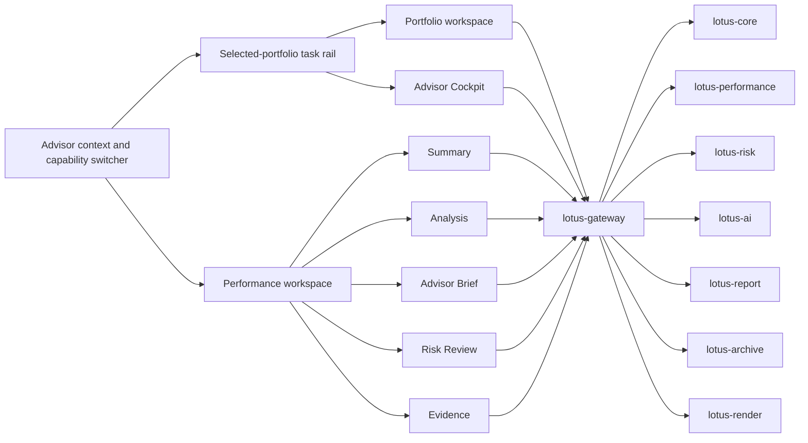

# Architecture

## Current Scope

This page describes the implemented Workbench presentation architecture and its Gateway-first
runtime boundary. Target-state service capabilities and domain authority remain in their owning
repositories and must not be inferred from a route or component shown here.

| Concern | Workbench Responsibility | Upstream Authority |
| --- | --- | --- |
| Product composition | Navigation, interaction, rendering, and bounded local UI state | Gateway capability and domain-service contracts |
| Domain decisions | Display source-owned outcomes and limitations | Core, Performance, Risk, Advise, Manage, Idea, Report, Archive, Render, or AI as applicable |
| Integration | Same-origin BFF mediation and caller-context propagation | Gateway is the product backend boundary |
| Operational proof | Browser, metrics, logs, and canonical validation evidence | Platform governance plus source-service readiness |

## Runtime model

- Next.js App Router application
- app-route mounting under `src/app/`
- app-local product ownership under `src/apps/`
- shared primitives under `src/design-system/`
- shell composition under `src/shell/`
- internal `/api/bff/*` proxy bridge to `lotus-gateway`
- disposable production-image replicas with no process-local business or session authority
- deterministic deployment identity for rolling-version protection

The versioned runtime, browser, support-lifecycle, and current scalability boundary is governed by
[Technology Risk and Runtime Support](Technology-Risk-and-Runtime-Support). That page records both
implemented evidence and explicit non-claims; architecture compatibility must not be presented as
capacity or bank certification.

## Presentation ownership

Workbench keeps design tokens and true cross-screen primitives in governed global layers. Feature
composition and component interaction states belong beside their React owner in CSS Modules; each
migration removes the corresponding legacy selectors and lowers the executable global-CSS budget.
CSS Modules are locally scoped owners, not alternative global layers: the blocking governance gate
discovers every module, parses selector ASTs so bare and functional `:global` pseudo-classes count,
permits zero new escapes by default, and holds each legacy exception to an exact no-headroom
count. Manage's Review Evidence rail is owned by its colocated
module; the wider Manage workspace stylesheet no longer reaches into that component through global
class names.

Responsive behavior follows available business canvas rather than device labels. Page and shell
composition may use viewport breakpoints, while a reusable analytical module that can appear beside
different rails uses inline-size container queries for its own internal reflow. Performance Drivers
applies this boundary at two levels: its ranked business groups choose comparison or stacked reading
from the module width, and each contribution row independently preserves readable identity, return,
weight, value, and bar evidence. This prevents a 1440-pixel three-rail workstation from being
mistaken for a wide content container and avoids page-specific fixes.

Business interpretation and technical evidence also have one presentation owner. A feature-level
pure model derives both layers from the same Gateway object: the primary scan explains business
posture, material limitation, and next action; a native disclosure retains exact status, reason
codes, contracts, lineage, and methodology evidence. Translation is allowlisted and conservative.
An absent, inconsistent, or unknown value stays neutral and visible in evidence rather than being
formatted into favourable copy. Page components consume this model; they do not duplicate code
mappings or construct a separate evidence story.

## Navigation model

Workbench separates three business contexts so the interface remains dense without becoming a
feature catalogue:

| Context | Visible by default | Ownership and boundary |
| --- | --- | --- |
| Advisor | **My book** | Global shell; preserves the active review date but does not infer team, delegate, or supervisory access |
| Workspace | Current capability plus **Switch** | Global shell; normalized Gateway capability posture controls which entries are actionable |
| Selected portfolio | Five daily-work domains, active specialist task, and current workflow step | Shared `PortfolioScreenRail`; secondary screens and alternative steps are disclosed on demand |

The daily-work domains are **Portfolio review**, **Performance**, **Advice**, **Reporting**, and
**Mandate management**. **All workspaces** groups specialist records, analysis, advice, and client
service destinations without duplicating the active task. The same model reflows at desktop,
tablet, and compact widths. Links remain semantic links; disclosure buttons close on Escape and
restore focus. A route being implemented does not override a disabled global capability posture.

Interactive relationships are owned by the business screen, not by render order. Each screen gives
the shared portfolio rail and decision worklist a stable semantic relationship base; the component
derives its navigation, directory, and selected-decision ids from that base. This keeps server and
initial-client HTML identical, prevents collisions when reusable components appear more than once,
and preserves truthful `aria-controls` relationships across desktop and compact compositions.
Suppressing hydration warnings or moving shared navigation to a client-only fallback is not an
accepted recovery strategy.

### Governed review context

`src/shell/review-context.ts` is the single URL authority for portfolio, valuation date, period,
reporting currency, selected record, and report-batch identity. It parses the governed fields as
one atomic context: one repeated, malformed, or unsupported value invalidates the complete context
before a screen requests source data. A route must not salvage a portfolio from an invalid address,
substitute a demo or first-catalogue portfolio, or combine facts from different review states.

The URL context and source-response identity are related but separate. A screen preserves a
supplied date, period, or currency only when the owning Gateway response confirms it. Each async
response must also confirm the portfolio and applicable valuation/window identity before it joins
the visible workspace. Selected-record and batch identities remain screen-local and are cleared
when their destination cannot interpret them; they do not become inferred cross-domain features.

User decisions create browser history with `push`; `replace` is reserved for source normalization
of the current entry. Back and Forward synchronize the matching source-backed props into the
mounted workspace, invalidate obsolete requests and caches as one boundary, and keep focus on the
stable visible control. Query-key remounts are not an acceptable history mechanism because they
discard focus and local interaction continuity.

`ReviewContextStrip` presents the source-confirmed orientation consistently across Portfolio,
Performance, Mandate Management, Advice, and Reporting. Routine business facts use sentence-case
productive labels and 14px values; only the short **Review portfolio** eyebrow is uppercase.
Partial and unavailable values remain readable but visually quieter, while identifiers stay behind
**Support details**. Consuming screens must pass a source-backed model and must not restyle the strip
or recreate its typography locally.

## Product-surface map

- `Portfolio`
  primary holdings, allocation, readiness, and next-actions experience
- `Performance`
  benchmark-aware performance, analysis, advisor brief, evidence, and risk modes
- `Workbench`
  compatibility workspace entry and portfolio-linked operational route
- `Proposals`
  direct Gateway-backed proposal queue/detail route for bounded advisor narrative delivery posture
- `Advisor Cockpit`
  `/recommendations?mode=cockpit` Gateway-backed operating workflow over Advise-owned action items,
  supportability, meeting preparation, tactical house-view impact review, and bounded
  acknowledgements
- `Advisory Copilot`
  `/recommendations?mode=copilot` Gateway-backed advisor-use copilot over Advise-owned
  proposal-version source projection, action runs, internal review posture, unsupported evidence,
  and blocked client-publication boundaries
- compatibility and capability-gated surfaces
  recommendations renders implemented Gateway-backed advisory modes while the top-level Advisory
  shell entry remains disabled; proposal simulation is a direct Gateway-backed advisory proposal
  draft entry backed by `lotus-advise`

## Boundary notes

1. workbench consumes gateway-shaped contracts
2. domain truth stays upstream
3. shell and design-system primitives should be preferred over page-local hacks
4. legacy compatibility routes should not be documented as the main active topology

## Functional Architecture



## Non-Functional Architecture

```mermaid
flowchart LR
  Browser[Browser interaction] --> Balancer[Environment-owned load balancer]
  Balancer --> ReplicaA[Workbench replica A]
  Balancer --> ReplicaB[Workbench replica B]
  ReplicaA --> Gateway[lotus-gateway]
  ReplicaB --> Gateway
  ReplicaA --> MetricsA[/api/metrics per instance]
  ReplicaB --> MetricsB[/api/metrics per instance]
  MetricsA --> Prometheus[Prometheus fleet aggregation]
  MetricsB --> Prometheus
  Prometheus --> Grafana[Grafana dashboards]
  ReplicaA --> Logs[structured route and BFF logs]
  ReplicaB --> Logs
  Gateway[Gateway] --> Logs
  Services[Core, Performance, Risk, AI, Report, Archive, Render, Manage] --> Logs
```

The diagram is an application requirement, not a committed production topology. Platform owners
must provide environment-specific replicas, readiness removal, termination grace, resource limits,
scrape discovery, rollback, and disruption controls. Workbench neither requires sticky sessions nor
owns durable business state. The repository scale harness proves this boundary as a bounded
engineering regression; it does not certify production HA, DR, capacity, identity, or multi-region
operation.

Observability labels are bounded by the analytics UI contract. Metric labels may describe route,
panel, operation, freshness, supportability, and status class, but must not include portfolio id,
client id, request body, response body, document id, session id, trace id, correlation id, or
screen content.
