# Integrations

## Primary backend posture

- `lotus-gateway`
  primary backend contract for product flows

Workbench must not call domain services directly for product behavior. Direct service probes in
live validation and evidence capture are limited to readiness, supportability, and operational
proof. User-facing portfolio, performance, risk, advisor brief, report, archive, and render flows
must travel through Gateway-shaped contracts.

## Canonical local runtime participants

- `lotus-core`
- `lotus-performance`
- `lotus-risk`
- `lotus-ai`
- `lotus-advise`
- `lotus-manage`
- `lotus-report`
- `lotus-gateway`
- `lotus-workbench`

## Canonical local identities

- workbench:
  `http://workbench.dev.lotus`
- gateway:
  `http://gateway.dev.lotus`

## Contract notes

1. gateway-first integration is the default
2. `/api/bff/*` is an internal bridge, not a second product API authority
3. canonical front-office validation depends on governed `*.dev.lotus` routing and seeded data
4. shell navigation supportability is informed by gateway-backed capability posture rather than by
   the mere existence of historical routes
5. Performance advisor-brief workflow-pack run posture and RFC-0097 task-flow lineage are rendered
   from gateway payloads; Workbench does not infer replacement lineage from narrative text or local
   fallback previews
6. RFC-0104 report batch operations use `/api/bff/api/v1/report-batches` only; Workbench does not
   call `lotus-report` directly for batch materialization, status, or bounded run-once execution
7. report batch materialization, status, and bounded run-once responses consume Gateway-preserved
   `report.observability.evidence_surface_supportability` metadata and emit only bounded
   freshness/supportability observability labels
8. Workbench report batch proof may use `/workbench/<portfolioId>?asOfDate=YYYY-MM-DD&benchmark=<backend benchmark code>`;
   the route keeps portfolio data date and report batch date visibly distinct when they differ
9. Archived report metadata and binary downloads use Gateway `/api/v1/documents/{document_id}` and
   `/api/v1/documents/{document_id}/download` through `/api/bff/api/v1/documents/*`; Workbench
   does not call `lotus-archive` directly, and the BFF preserves binary responses and integrity
   headers for PDF downloads
10. Outcome-review report job requests use Gateway `POST /api/v1/reports/outcome-reviews` through
    `/api/bff/api/v1/reports/outcome-reviews` after loading manage-owned `DpmOutcomeReportInput`.
    Workbench does not call `lotus-report`, `lotus-render`, or `lotus-archive` directly for
    report materialization.
11. Outcome-review AI narrative requests use Gateway
    `POST /api/v1/dpm/command-center/outcome-reviews/{outcome_review_id}/ai-narrative` through
    `/api/bff/api/v1/dpm/command-center/outcome-reviews/{outcome_review_id}/ai-narrative`.
    Workbench does not call `lotus-manage` or `lotus-ai` directly, does not construct prompts, and
    displays only bounded workflow-pack run posture returned by Gateway.
12. Construction alternative generation, retrieval, and selection use Gateway
    `/api/v1/dpm/command-center/construction/alternative-sets*` through the Workbench BFF.
    Workbench sends stateful source selectors for manage/core resolution, displays manage-owned
    comparison and supportability truth, and records PM selection through Gateway; it does not call
    `lotus-manage` directly or invent stateless portfolio snapshots, prices, optimizer output, or
    selected-alternative state.
13. Rebalance action-register supportability is read from the Gateway portfolio overview
    `rebalance_snapshot`. Workbench displays manage-owned status, source support state, freshness,
    run count, operation count, workflow decision count, last-run identity, bounded recent runs,
    workflow posture, run issue count, and reason posture; it does not call `lotus-manage`
    directly and does not convert missing supportability or absent recent runs into apparently
    verified zero activity.
14. RFC-0108 analytics UI observability is centralized in
    `src/features/analytics-observability/metrics.ts`. Supported Portfolio, Intake, Performance,
    Risk, Reporting, Data Products, and legacy advisor Workbench gateway-backed reads/mutations
    emit bounded route, panel, operation, freshness, and supportability labels only; portfolio,
    intake payload, document, session, trace, request, response, and screen-content identifiers
    must not appear in metric labels.
15. `lotus-manage` is not a proposal/advisory upstream for Workbench. DPM product surfaces must be
    backed by strategic Gateway APIs before Workbench exposes them. RFC-0098 keeps Workbench as a
    renderer of Gateway-composed mandate and proof-pack truth, not a direct caller of manage, risk,
    performance, core, report, archive, or AI. RFC-0040 proof-pack JSON, hashes, Markdown,
    report-input payloads, and AI-evidence payloads remain manage-owned, while proof-pack PM memo
    execution remains `lotus-ai` owned; both must reach Workbench through Gateway composition.
    RFC-0041 rebalance-wave preview, create, source-check, simulation, selection, approval,
    staging, handoff, supportability, and report-input also remain manage-owned, while wave PM
    memo and operations-handoff summary execution remain `lotus-ai` owned; both must reach
    Workbench through Gateway wave composition only. RFC-0039
    construction alternative generation, retrieval, supportability, and selection are manage-owned
    and must reach Workbench through Gateway construction composition only. RFC-0042
    outcome-review search, detail, supportability, report-input, AI-evidence, preview, create, and
    source-refresh posture also remain manage-owned, while AI narrative execution remains
    `lotus-ai` owned; both must reach Workbench through Gateway outcome-review composition only.
    RFC40-WTBD-010 portfolio-memory timeline events, source refs, artifact refs, event counts,
    source systems, reason codes, supportability, and content hashes remain manage-owned and must
    reach Workbench through Gateway portfolio-memory composition only.
    RFC-0043 monitoring-exception summary execution remains `lotus-ai` owned and must reach
    Workbench through Gateway exception-summary composition only.
    The implemented Workbench construction panel consumes the Gateway construction alternative-set
    contracts, the implemented wave command-center panel consumes Gateway wave list, preview,
    create, detail, item, source-check, simulation, approval, staging, handoff, proof-posture,
    supportability, report-input, AI PM memo, and operations-handoff summary contracts, the
    implemented proof-pack panel consumes the Gateway proof-pack
    generation, detail, Markdown, report-input, AI-evidence, and AI PM memo contracts, and the
    implemented outcome panel consumes the Gateway outcome-review list and AI-narrative contracts.
    The implemented command-center exception queue consumes the Gateway exception-summary contract.
    The implemented portfolio-memory panel consumes the Gateway portfolio-memory contract and
    preserves manage event order without reconstructing timeline nodes.
    Workbench must not calculate expected-versus-realized values. It must not rebuild proof-pack
    sections, compute proof-pack hashes, construct prompts, infer PM quality, calculate wave
    readiness, construct report input, generate memo or exception-summary narrative locally, reconstruct
    portfolio-memory events, claim external execution, or optimize construction alternatives;
    proof-pack sections and wave report input remain manage-owned evidence.
16. The implemented RFC-0038 mandate command-center cockpit consumes Gateway
    `/api/v1/dpm/command-center`, `/monitoring/run-once`, `/exceptions`, and `/mandates*`
    contracts. Workbench renders manage-owned health distribution, source readiness,
    supportability, active exceptions, monitoring-run lineage, and mandate health dimensions
    without reconstructing mandate-health scores, source readiness, PM-book membership, exception
    queues, or resolution state.
17. `lotus-advise` owns advisor-led proposal workflows. Workbench proposal compatibility routes are
    not the active RFC-0108 product surface and should not be used as current client-demo evidence.

## Ownership Diagram

```mermaid
flowchart TB
  Workbench[lotus-workbench product UI]
  Gateway[lotus-gateway product API]
  Core[Portfolio and reference data]
  Performance[Performance analytics]
  Risk[Risk analytics]
  AI[Advisor brief generation and workflow-pack review]
  Report[Report materialization and report supportability]
  Archive[Document metadata and downloads]
  Render[PDF render readiness]
  Manage[Strategic DPM proof packs, waves, and outcome reviews]
  Construction[Construction alternatives lab]
  ProofPacks[Proof-pack evidence panel]
  Waves[Rebalance-wave command-center panel]
  Outcomes[Post-trade outcome panel]
  Advise[Advisor-led proposal workflows]
  DpmCenter[DPM command center UI]

  Workbench -->|/api/bff/api/v1/workbench/*| Gateway
  Workbench --> DpmCenter
  Workbench -->|/api/bff/api/v1/dpm/command-center*| Gateway
  Workbench -->|/api/bff/api/v1/dpm/command-center/construction/alternative-sets*| Gateway
  Workbench -->|/api/bff/api/v1/dpm/command-center/proof-packs*| Gateway
  Workbench -->|/api/bff/api/v1/dpm/command-center/portfolios/*/memory| Gateway
  Workbench -->|/api/bff/api/v1/dpm/command-center/waves*| Gateway
  Workbench -->|/api/bff/api/v1/dpm/command-center/outcome-reviews*| Gateway
  Workbench -->|AI narrative action via Gateway only| Gateway
  DpmCenter --> Waves
  DpmCenter --> Construction
  DpmCenter --> ProofPacks
  DpmCenter --> Outcomes
  DpmCenter -->|Gateway RFC-0098 contract| Gateway
  Gateway --> Core
  Gateway --> Performance
  Gateway --> Risk
  Gateway --> AI
  Gateway --> Report
  Gateway --> Archive
  Gateway --> Render
  Gateway --> Manage
  Gateway -. future/current external proposal boundary .-> Advise
  Workbench -. validation evidence only .-> Manage
```

