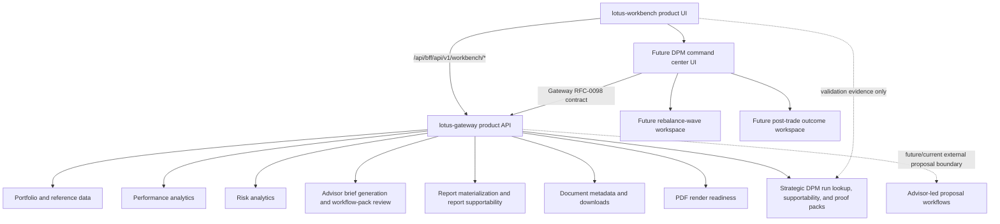

# Integrations

## Primary backend posture

- `lotus-gateway`
  primary backend contract for product flows

Workbench must not call domain services directly for product behavior. Direct service probes in
live validation and evidence capture are limited to readiness, supportability, and operational
proof. User-facing portfolio, performance, risk, advisor brief, report, archive, and render flows
must travel through Gateway-shaped contracts.

## Canonical local runtime participants

- `lotus-core`
- `lotus-performance`
- `lotus-risk`
- `lotus-ai`
- `lotus-advise`
- `lotus-manage`
- `lotus-report`
- `lotus-gateway`
- `lotus-workbench`

## Canonical local identities

- workbench:
  `http://workbench.dev.lotus`
- gateway:
  `http://gateway.dev.lotus`

## Contract notes

1. gateway-first integration is the default
2. `/api/bff/*` is an internal bridge, not a second product API authority
3. canonical front-office validation depends on governed `*.dev.lotus` routing and seeded data
4. shell navigation supportability is informed by gateway-backed capability posture rather than by
   the mere existence of historical routes
5. Performance advisor-brief workflow-pack run posture and RFC-0097 task-flow lineage are rendered
   from gateway payloads; Workbench does not infer replacement lineage from narrative text or local
   fallback previews
6. RFC-0104 report batch operations use `/api/bff/api/v1/report-batches` only; Workbench does not
   call `lotus-report` directly for batch materialization, status, or bounded run-once execution
7. report batch materialization, status, and bounded run-once responses consume Gateway-preserved
   `report.observability.evidence_surface_supportability` metadata and emit only bounded
   freshness/supportability observability labels
8. Workbench report batch proof may use `/workbench/<portfolioId>?asOfDate=YYYY-MM-DD&benchmark=<backend benchmark code>`;
   the route keeps portfolio data date and report batch date visibly distinct when they differ
9. Archived report metadata and binary downloads use Gateway `/api/v1/documents/{document_id}` and
   `/api/v1/documents/{document_id}/download` through `/api/bff/api/v1/documents/*`; Workbench
   does not call `lotus-archive` directly, and the BFF preserves binary responses and integrity
   headers for PDF downloads
10. RFC-0108 analytics UI observability is centralized in
    `src/features/analytics-observability/metrics.ts`. Supported Portfolio, Intake, Performance,
    Risk, Reporting, Data Products, and legacy advisor Workbench gateway-backed reads/mutations
    emit bounded route, panel, operation, freshness, and supportability labels only; portfolio,
    intake payload, document, session, trace, request, response, and screen-content identifiers
    must not appear in metric labels.
11. `lotus-manage` is not a proposal/advisory upstream for Workbench. Current Workbench proof uses
    Manage only for readiness and supportability evidence through
    `GET /api/v1/rebalance/supportability/summary`; any future discretionary mandate management
    product surface must be backed by new strategic Gateway APIs before it is exposed in Workbench.
    RFC-0098 defines that future DPM command-center experience and keeps Workbench as a renderer of
    Gateway-composed mandate and proof-pack truth, not a direct caller of manage, risk,
    performance, core, report, archive, or AI. RFC-0040 proof-pack JSON, hashes, Markdown,
    report-input payloads, and AI-evidence payloads remain manage-owned and must reach Workbench
    through Gateway composition. RFC-0041 rebalance-wave preview, create, source-check,
    simulation, selection, approval, staging, handoff, and supportability also remain
    manage-owned and must reach Workbench through Gateway wave composition only. RFC-0042
    outcome-review search, detail, supportability, report-input, AI-evidence, preview, create, and
    source-refresh posture also remains manage-owned and must reach Workbench through Gateway
    outcome-review composition only; Workbench must not calculate expected-versus-realized values
    or infer PM quality.
12. `lotus-advise` owns advisor-led proposal workflows. Workbench proposal compatibility routes are
    not the active RFC-0108 product surface and should not be used as current client-demo evidence.

## Ownership Diagram

