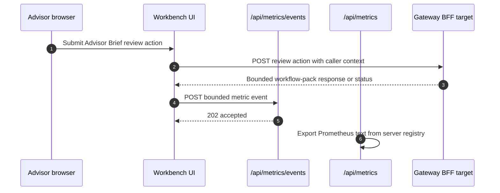

# Operations Runbook

## Important operational checks

- use `workbench.dev.lotus` and `gateway.dev.lotus` for canonical product proof
- use seeded portfolio `PB_SG_GLOBAL_BAL_001` unless the slice explicitly targets another dataset
- keep diagnostic screenshots separate from final demo evidence
- validate the canonical stack before treating screenshots as review-ready
- treat capability-disabled shell entries as contract truth, not as something to work around in
  demo documentation

## Practical runtime flow

```powershell
npm run live:stack:up
npm run live:validate
npm run live:stack:down
```

The canonical startup script defaults `lotus-ai` to `.env.example` for deterministic
provider-disabled proof, even if a local `lotus-ai/.env` asks for a live or local provider. Pass
`-LotusAiEnvFile .env` only when the required provider dependency is intentionally running.

Docker is the default runtime for the canonical front-office app set: Workbench, Gateway, Core,
Performance, Risk, Advise, Manage, Report, Archive, Render, and AI. For active RFC development,
use `-LocalApps` to replace selected Docker-backed apps with same-port local processes while
keeping canonical hostnames and validation evidence stable. The common Workbench UI path is:

```powershell
npm run live:stack:up:workbench-local
```

## Browser-facing probes

```txt
http://workbench.dev.lotus/portfolio
http://workbench.dev.lotus/performance?portfolioId=PB_SG_GLOBAL_BAL_001
http://workbench.dev.lotus/performance?portfolioId=PB_SG_GLOBAL_BAL_001&mode=risk
```

## Analytics UI observability posture

- RFC-0108 analytics UI observability vocabulary is code-owned in
  `src/features/analytics-observability/contract.ts`.
- Workbench emits local analytics UI metric events for the supported Portfolio workspace,
  client-side Performance summary, Performance details, horizon comparison, attribution trend,
  advisor brief, advisor brief review actions, Risk summary, Risk concentration, Risk drawdown,
  Risk rolling, Risk attribution, and explicit report-batch operator reads through
  `src/features/analytics-observability/metrics.ts`.
- Workbench emits bounded local attention events and the
  `lotus_analytics_ui_attention_events_total` counter for stale, degraded, partial-source, and
  repeated-failure states on those selected analytics panels. Attention labels are deduplicated and
  limited to governed route, panel, service, operation, state, reason, freshness, supportability,
  attention type, and severity fields.
- Workbench derives supported-read support state from source-shaped metadata such as
  `supportability.state`, `supportability.freshness_bucket`, supportability item arrays, and
  Gateway `source_supportability` arrays before recording panel state, hydration, and attention
  metrics. Any stale source supportability item takes precedence over fresh source items so stale
  upstream posture cannot be hidden by another ready source.
- `/api/metrics` exposes the implemented Workbench analytics UI metric families in Prometheus text
  format for platform scrape and dashboard/alert contracts.
- Client-side Workbench actions, including Advisor Brief review transitions, publish only bounded
  analytics metric events back to `/api/metrics/events`; the server-side metrics registry then
  exposes them through `/api/metrics`. This keeps mutation observability visible to Prometheus
  without accepting raw request bodies, response bodies, portfolio ids, client ids, correlation ids,
  or reviewer identity as labels. State-changing actions are intentionally excluded from panel
  hydration histograms because the action observes a mutation result rather than a panel load.
- Do not add panel, route, or browser telemetry labels outside that contract.
- `portfolio_id`, `client_id`, `client_name`, `holding_id`, `transaction_id`, `document_id`,
  `batch_id`, `report_job_id`, `session_id`, `trace_id`, `correlation_id`, request bodies,
  response bodies, and screen content must not become metric labels or browser event fields.
- Gateway or BFF mutation failures should surface bounded status-class posture only. Review-action
  and report-batch failures must not copy raw upstream problem details or entitlement text into UI
  error messages or metric labels.
- Canonical browser proof for the supported Slice 14 Portfolio, Performance, Risk, and
  report-batch reads has passed for `PB_SG_GLOBAL_BAL_001`; full RFC-0079 risk/evidence scope
  remains governed by later RFC-0108 evidence. The performance evidence surface now renders
  Gateway-backed RFC-0079 product context for as-of date, period, basis, benchmark, source services,
  freshness, methodology, calculation versions, coverage, fallbacks, and limitations where the
  Gateway evidence contract provides it. Canonical validation records `supportabilityChecks` for
  Gateway `source_supportability` evidence on performance and risk payloads.
- The report-batch operations panel includes a Gateway-backed archived document lookup for
  operator retrieval. Metadata reads use `/api/bff/api/v1/documents/{document_id}?current=true`,
  downloads use `/api/bff/api/v1/documents/{document_id}/download`, and the shared BFF proxy
  preserves binary PDF payloads plus checksum/content-disposition headers.



## Output paths

- screenshots and summary:
  `output/playwright/live-canonical/`
- machine-readable summary:
  `output/playwright/live-canonical/live-validation-summary.json`
- observability and operations evidence:
  `output/observability-live/<timestamp>/`

## Review-ready evidence

- use canonical validated captures for demos, PR review, and operator handoff
- keep pre-validation captures clearly labeled as diagnostic artifacts only
- when a route exists but is capability-disabled, capture the supported active path instead of the
  dormant compatibility page

## Observability evidence capture

After `npm run live:validate` passes, capture an operations-oriented evidence pack:

```powershell
npm run live:evidence
```

The pack includes hostname resolution, container inventory, readiness and representative API
outputs, Workbench Prometheus metrics, Prometheus/Grafana API samples, bounded container log tails,
and screenshots for Workbench evidence views plus Prometheus/Grafana entrypoints. Use this pack for
offline client-demo preparation and operational documentation. It complements
`live-validation-summary.json`; it does not replace the governed validation gate.

## Key references

- [docs/operations/canonical-front-office-local-runtime.md](../docs/operations/canonical-front-office-local-runtime.md)
- [docs/demo/README.md](../docs/demo/README.md)
