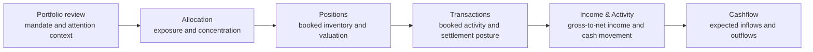

# Portfolio Review Workflow

The Portfolio record screens support a structured private-banking review: establish the mandate
context, understand what the portfolio owns, explain booked activity, and then review expected cash
movement. Each screen keeps the selected portfolio identity and reports source evidence rather than
creating new investment, transaction, or settlement authority in the browser.

## Business review flow

This is a review sequence, not a forced navigation path. A relationship manager preparing for a
client conversation may start with Portfolio review, while a portfolio manager or operations user
may enter directly at the relevant exception screen.

## Which screen answers which question?

| Screen | Business question | Information that belongs together | Important boundary |
| --- | --- | --- | --- |
| Portfolio review (`/portfolio`) | What is the current mandate and where does attention need to go? | Portfolio identity, valuation context, mandate posture, summary evidence, and paths into record detail | Review context is not a recommendation, approval, or trade instruction. |
| Allocation (`/allocation`) | Where is the portfolio exposed, and which booked holdings contribute to a direct exposure? | Source allocation views, exposure weights, concentration context, cash balances, and contributing booked holdings | Expanded look-through contributors, targets, drift, suitability, and rebalance advice are not inferred locally. |
| Positions (`/positions`) | What does the portfolio currently own? | Complete booked securities and cash inventory, valuation, cost basis, portfolio weight, P&L, and recent holding-activity lineage | Recent activity is not the full ledger; tax lots, restrictions, recommendations, and execution are outside this screen. |
| Transactions (`/transactions`) | What activity was booked, and what needs settlement review? | Transaction-currency gross amount, portfolio-currency net cost and realized P&L, booking components, settlement posture, source coverage, and related-event review | Workbench does not book, amend, approve, execute, settle, or reconcile transactions. |
| Income & Activity (`/income`) | How do booked income and deductions reconcile, and how did source-classified activity move cash? | Gross income, withholding, other deductions, net income, and source-defined inflow, outflow, fee, and tax buckets | The screen does not forecast income, provide tax advice, or turn activity into a recommendation. |
| Cashflow (`/cashflow`) | What inflows and outflows are expected over the selected horizon? | Explicit 10-, 30-, or 90-day horizon, projection as-of and through dates, net movement, dated movements, projection basis, limitations, and support reference | Figures show projected movement, not opening cash, ending cash, liquidity sufficiency, or funding capacity. |

## How to use the information

1. Confirm the portfolio, mandate type, reporting currency, and as-of context before comparing
   figures.
2. Use Allocation to identify an exposure worth explaining, then Positions to inspect its booked
   contributors and valuation evidence.
3. Use Transactions for ledger and settlement review; use Income & Activity for gross-to-net income
   and source-classified movement. Do not combine these into a locally invented net-flow figure.
4. Use Cashflow only for the selected forward horizon. Keep projected movement separate from booked
   transactions and historical activity.
5. Treat warnings, partial failures, unavailable detail, stale source posture, and support references
   as part of the business result. Do not interpret missing detail as zero activity or an all-clear.

## Evidence and recovery

- Ready means the requested source-backed business payload is available for the selected portfolio
  and scope.
- Partial or degraded means useful source data is present with an explicit limitation; review the
  evidence panel before relying on the figures.
- Unavailable means Workbench could not confirm the requested result. Seeded or previously visible
  figures remain unconfirmed until an authoritative refresh succeeds.
- Retry controls request source authority again. They do not manufacture a browser-side answer.
- Export is available only when the displayed result and its source identity are confirmed for the
  selected scope.

## Supported authority

Workbench is a Gateway-backed review surface. It does not calculate source-owned portfolio truth or
grant advice, suitability, approval, order, execution, settlement, tax, client-publication, or
autonomous AI authority. Use the owning Lotus service and governed workflow when one of those
actions is required.
